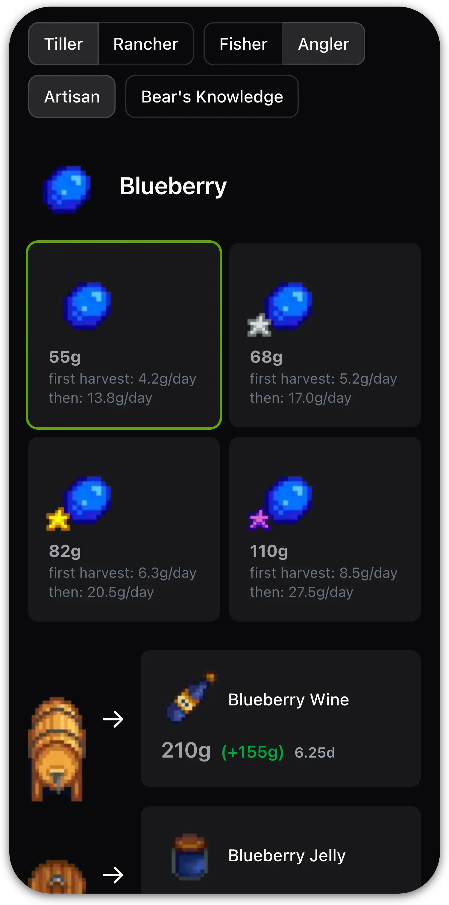
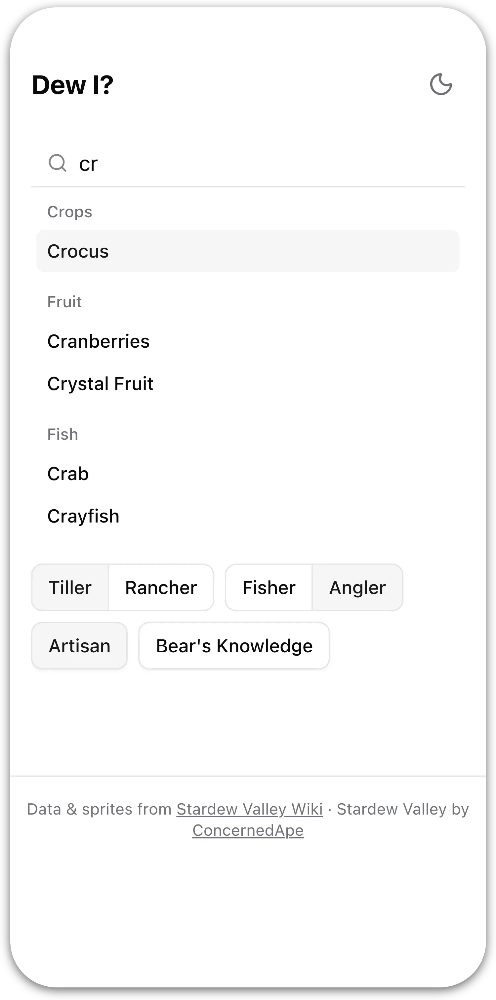
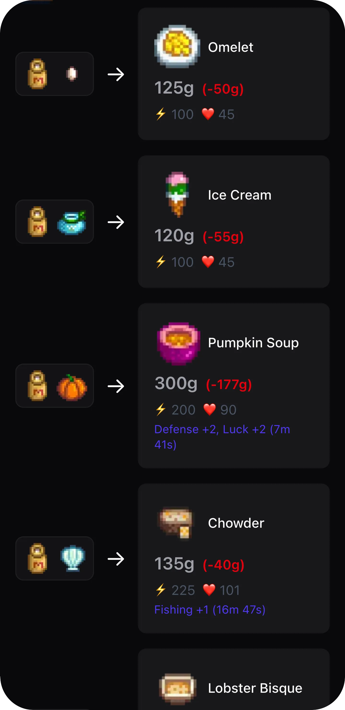

# Dewi — Dew I or don't I?

**[Try it → dewi.gibby.dev](https://dewi.gibby.dev)**

> A lightweight, mobile-first companion app for Stardew Valley players who think too hard about what to _dew_ with their items.

<p align="center">
  
  &nbsp;&nbsp;
  
  &nbsp;&nbsp;
  
</p>

- Search for any crop, fruit, fish, or animal product and compare sell prices across all quality levels
- See every processor transformation and whether it's worth the cost
- Check recipes (ingredient breakdown + buff info) associated with an item
- Prices adjust live for your professions - Tiller, Artisan, Angler, etc.
- Dark + light mode support

[](https://app.netlify.com/projects/dewio/deploys)

## Development

Building and running:

```bash
npm install
npm run dev
```
Testing:

```bash
npx vitest run
```

## Tech stack

- [Next.js](https://nextjs.org/)
- [Tailwind CSS](https://tailwindcss.com/)
- [Radix UI](https://www.radix-ui.com/)
- [Vitest](https://vitest.dev/)

## Credits

- Game data and assets sources from the [Stardew Valley Wiki](https://stardewvalleywiki.com).
- Stardew Valley created by [ConcernedApe](https://x.com/concernedape)